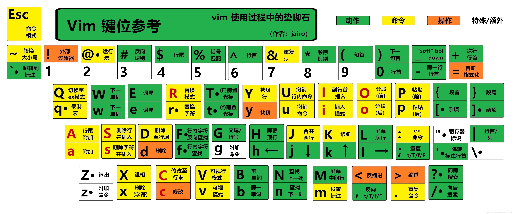

# vim

> 配置文件：<span class="strong code">vim ~/.vimrc</span>
>
## 中文乱码

```bash
set termencoding=utf-8
set encoding=utf8
```

## 常用配置

```bash
# 显示行号
set nu
# 语法高亮
syntax on
# 显示当前光标位置
set ruler
```

## 快捷键


