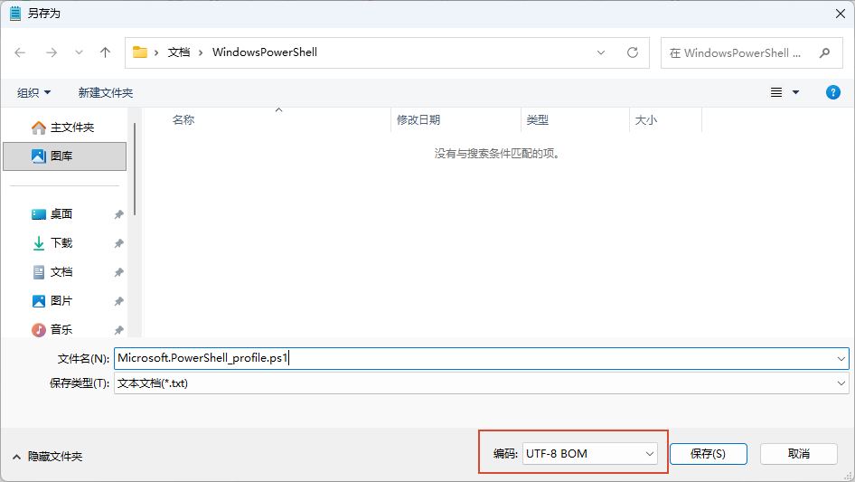

# 中文乱码

## 检查`Profile`是否存在

```powershell
Test-Path $PROFILE
# 如果上一行命令执行后显示False，则执行此行命令
New-Item -Path $PROFILE -ItemType File -Force
```

## 打开`Profile`文件

```powershell
notepad $PROFILE
```

> 填入以下内容
```
# PowerShell UTF-8 Encoding Configuration
# =============================================

# Set console encoding to UTF-8
[Console]::OutputEncoding = [System.Text.Encoding]::UTF8
[Console]::InputEncoding = [System.Text.Encoding]::UTF8
$OutputEncoding = [System.Text.Encoding]::UTF8

# Set code page to UTF-8
chcp 65001 | Out-Null

# Set default parameter encoding
$PSDefaultParameterValues['Out-File:Encoding'] = 'utf8'
$PSDefaultParameterValues['*:Encoding'] = 'utf8'
```

## 保存为 `UTF-8 BOM` 格式

